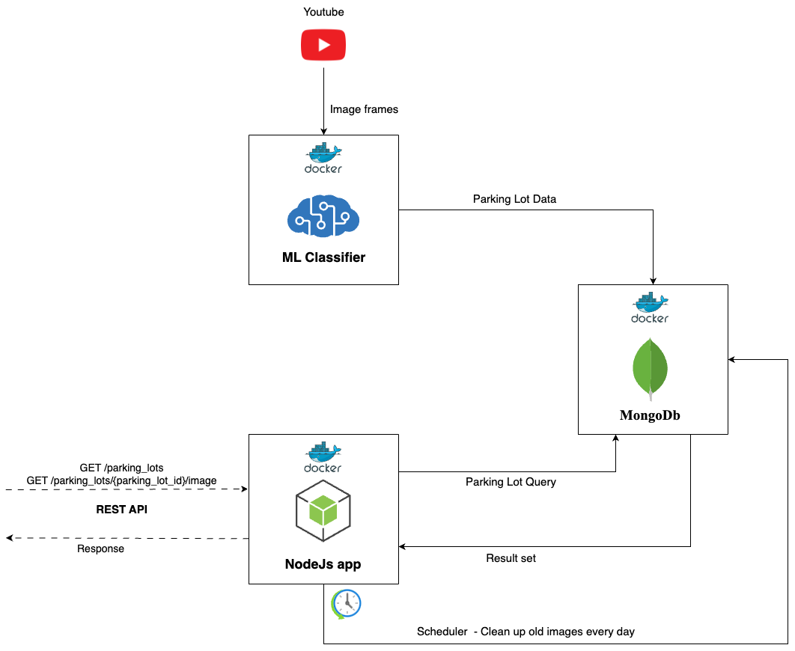

# Smart-Park

## Overview

This work is based on [Sriranga Chaitanya Nandam's Master's Project](https://research.engr.oregonstate.edu/si-lab/#archive):
* [PDF](https://research.engr.oregonstate.edu/si-lab/archive/2022_chaitanya.pdf)
* [Github](https://github.com/NSR9/Smart-Park)

Ingress and egress pipelines developed by Chaitanya, have undergone modifications to enhance their performance and scalability. 
The ingress pipeline, i.e. the ML classifier has been refactored to insert data into a MongoDb database and is now executed as a Docker container.
Likewise, the egress pipeline, which was previously hosted on AWS using technologies like Lambda and API Gateway, has been migrated to a simpler NodeJs server, tasked with fetching data from MongoDb.
Both pipelines, along with the MongoDb, are now bundled and executed as Docker containers.

## Sections
* [Architecture Diagram](#architecture-diagram)
* [Usage](#usage)
  * [Production Setup](#production-setup)
    * [Setting up MongoDb](#i-setting-up-mongodb)
    * [Setting up ML classifier](#ii-setting-up-ml-classifier)
      * [OSU access](#osu-access)
      * [Non OSU access](#non-osu-access)
    * [Setting up NodeJs application](#iii-setting-up-nodejs-application)
  * [Local/Dev Setup](#localdev-setup)
    * [Setting up MongoDb](#setting-up-mongodb)
    * [Setting up ML classifier](#setting-up-ml-classifier)
    * [Setting up NodeJs application](#setting-up-nodejs-application)
* [Resources](#resources)

## Architecture Diagram



## Usage

The usage instructions is divided into 2 parts, depending on where the components are being deployed.
1. [Production setup](#production-setup) 
2. [Local/Dev setup](#localdev-setup)

### Production setup

For setting up the production environment, we assume that all the three components will be packaged and run as individual docker containers.

*All the 3 containers should ideally run on different servers so that it doesn't result in a single point of failure/cascade failure.*

#### Requirements
* Docker - Install the latest stable version of docker from [here](https://docs.docker.com/desktop/install/linux-install/) 

#### I. Setting up MongoDb
1. Download the mongodb image

```sh
docker pull mongo:6.0
```

2. Run a container using the above image

```sh
docker run -dp 27017:27017 --name mongo --restart always mongo:6.0
```

#### II. Setting up ML classifier

##### OSU access
Continue with this section if you have an OSU account and have access to this box [folder](https://oregonstate.app.box.com/folder/209117371306). 
If not, jump ahead to the [next](#non-osu-access) section.

1. Ensure you are on a system with x86 architecture and Linux operating system
2. System has at least 2GB of RAM and 24GB of disk space 
3. Download the latest Smart Park tar archive file from the box folder over [here](https://oregonstate.app.box.com/folder/209117371306) 
4. Unzip the tar archive
    ```sh
    tar -xzvf <filename>.tar.gz
    ```

5. Build a docker image from the tar archive
   ```sh
   docker load --input <filename>.tar
   ```
   
6. Confirm whether the image has been created successfully by executing the following command
    ```sh
    docker images
    ```
   
7. Run a docker container using the newly generated image. The command will launch a new container in detached mode.
    ```sh
    docker run -d --env DB_CONN_STR=HOSTNAME --name spclassifier --restart always <image_name>
    ```
    DB_CONN_STR is the mongodb connection string that needs to be passed as an environment variable to the container.
    Example:
    
    * Using database server's DNS: `DB_CONN_STR=db.domain.com:{port}`
    * Using database server's public/external IP: `DB_CONN_STR=x.x.x.x:{port}`
    * Testing locally: `DB_CONN_STR=localhost:{port}` or `DB_CONN_STR=127.0.0.1:{port}`

8. Inspect the container logs and verify if the pipeline is running without any errors
    ```sh
    docker logs -f --tail 500 spclassifier
    ```

9. Log in to the MongoDb container and verify if records are getting inserted into `recentParkingLots` and `parkingLotHistory` collections.

##### Non OSU access 
1. Ensure that you are on a Linux system with x86 architecture. If you don’t have access to one, follow the below instructions.
   Note: These instructions assume that you will be using AWS as the cloud service provider. Skip this step if you are using a different provider.
   1. Go to EC2 console in AWS
   2. Create a new instance with the following configuration
      1. Name: SmartPark
      2. AMI: Ubuntu 22.04
      3. Architecture: 64-bit x86
      4. Type: t2.small
      5. Create a new key pair or select an existing one
      6. In network settings, select the default VPC (Create a new one if you want)
      7. Enable Auto assign public IP
      8. Create a new security group and allow SSH traffic from your IP
      9. In Storage settings, allocate a minimum of 24GiB of gp2 storage
      10. Launch the instance
      11. Connect to the instance through SSH

2. Install docker by following the instructions [here](https://docs.docker.com/engine/install/ubuntu/)
3. Clone the SmartPark repository from [here](https://github.com/subramanya1702/Smart-Park-Reboot)
4. Download the pytorch file: X-512.pt from [here](https://oregonstate.app.box.com/file/1221361939384)
5. Now that everything is set up, we can go ahead and build a docker image
    ```sh
    sudo docker build -t spclassifier .
    ```
   
6. Copy the image to wherever necessary/convenient.
7. Run a docker container using the newly copied image. The command will launch a new container in detached mode.
    ```sh
    sudo docker run -d --env DB_CONN_STR=HOSTNAME --name spclassifier --restart always spclassifier
    ```
    DB_CONN_STR is the mongodb connection string that needs to be passed as an environment variable to the container.
    Example:
    
    * Using database server's DNS: `DB_CONN_STR=db.domain.com:{port}`
    * Using database server's public/external IP: `DB_CONN_STR=x.x.x.x:{port}`
    * Testing locally: `DB_CONN_STR=localhost:{port}` or `DB_CONN_STR=127.0.0.1:{port}`

8. Log in to the MongoDb container and verify if records are getting inserted into `recentParkingLots` and `parkingLotHistory` collections.
9. Don't forget to deallocate any resources that were provisioned on AWS.


#### III. Setting up NodeJs Application

1. Clone the repository

```sh
git clone git@github.com:subramanya1702/Smart-Park-Server.git
```

2. Navigate to the project directory

```sh
cd Smart-Park-Server
```

3. Build/create an image

```sh
docker build -t spserver .
```

4. Run a container with the above image

```sh
docker run -dp {port}:{port} --env DB_CONN_STR={MONGO_CONNECTION_STRING} --env HOSTNAME={NODE_JS_SERVER_HOSTNAME} --name spserver --restart always spserver 
```

DB_CONN_STR is the mongodb connection string that needs to be passed as an environment variable to the container.

Example:

* Using database server's DNS: DB_CONN_STR=db.domain.com:{port}
* Using database server's public/external IP: DB_CONN_STR=x.x.x.x:{port}
* Testing locally: DB_CONN_STR=localhost:{port} or DB_CONN_STR=127.0.0.1:{port}

HOSTNAME is an optional environment variable that has to be passed if the application is being run in prod mode.
If the application is running in dev mode (running locally), it can be skipped.

Example:

* Using node js server's DNS: `HOSTNAME=njs.domain.com`
* Using node js server's public/external IP `HOSTNAME=x.x.x.x`

5. Go to `https://some.domain/parking_lots` or `https://PUBLIC_IP:8080/parking_lots` and verify if you are getting the proper response.

### Local/Dev setup

For setting up the local/dev environment, you can either follow the instructions for [production setup](#production-setup) or follow the below instructions if you don't want to use docker.

#### Requirements
* Node >= 14.0.0
* Mongodb >= 6.0.0
* Python = 3.9
* Python VirtualEnv

#### Setting up MongoDb
1. Install mongodb by following the instructions over [here](https://www.mongodb.com/docs/manual/installation/)

#### Setting up ML classifier
1. Clone the Smart-Park-Reboot repository
```sh
git clone https://github.com/subramanya1702/Smart-Park-Reboot
```

2. Navigate to the `smart_park` directory
```sh
cd Smart-Park-Reboot/smart_park
```

3. Create a python virtual environment and activate it.
4. Install the dependencies
```sh
pip install requirement.txt
```

5. Copy `activation.py` file to `usr/local/lib/python3.9/site-packages/torch/nn/modules/` directory
6. Run the classifier
```sh
python run_process1.py
```
7. Login to Mongodb and verify if records are getting inserted into `recentParkingLots` and `parkingLotHistory` collections.

#### Setting up NodeJs Application

1. Clone the repository

```sh
git clone https://github.com/subramanya1702/Smart-Park-Server.git
```

2. Navigate to the project directory

```sh
cd Smart-Park-Server
```

3. Install dependencies

```sh
npm install
```

4. Run the application

```sh
npm run start:dev
```
5. Go to `http://localhost:8080/parking_lots` and verify if you are getting the proper response.

## Resources

* The GitHub repositories for ML classifier and NodeJs application can be found below.
  * [ML classifier](https://github.com/subramanya1702/Smart-Park-Reboot)
  * [NodeJs application](https://github.com/subramanya1702/Smart-Park-Server)

* [Install Docker](https://docs.docker.com/desktop/install/linux-install/)
* [Install MongoDb](https://www.mongodb.com/docs/manual/installation/)
* [OSU Box folder](https://oregonstate.app.box.com/folder/209117371306)
## Contributors
Subramanya Keshavamurthy